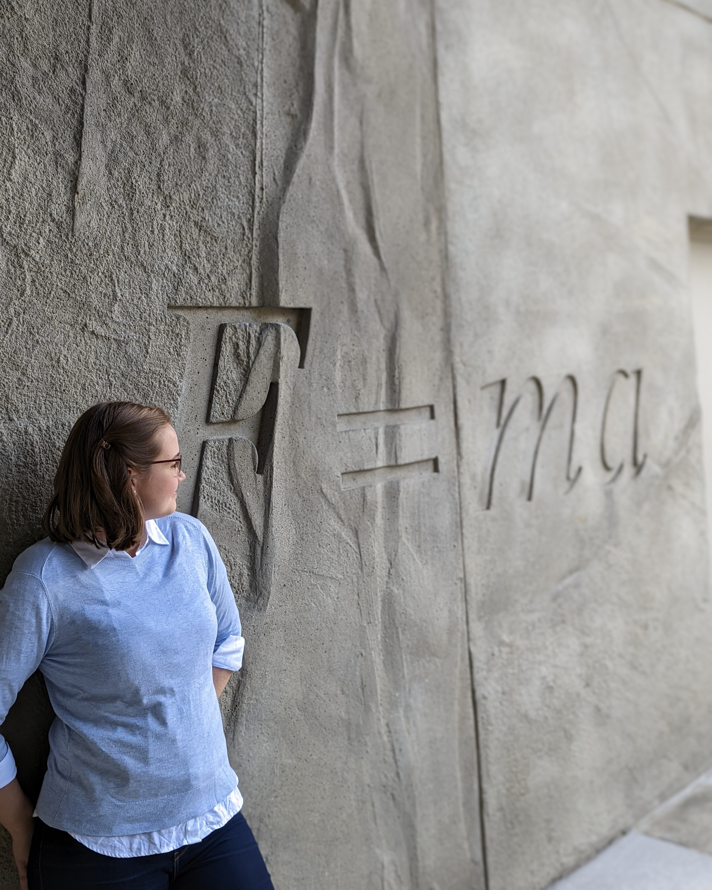

#About me
{align="right": style="height:375px;width:300px"}
I am a PhD student in the Department of Physics at McGill University, supervised by Dr. Vicky Kaspi and Dr. Jason Hessels. My [research](./research/index.md) primarily focuses on Fast Radio Bursts, short bursts of radio waves emitted by unknown sources in distant galaxies, utilizing the CHIME Radio Telescope. Previously, I completed a Master's of Science in Physics and Astronomy at McMaster University under the supervision of Dr. Doug Welch. My MSc thesis examined the application of image recognition machine-learning software to identify historic supernova light echoes. I did my Bachelor of Science in my hometown of Edmonton at the University of Alberta.

I am also passionate about [teaching](./teaching/index.md) and [volunteering](./volunteering/index.md) in my community. 

Outside of academics, I am an avid knitter, crocheter, and fibre artist. I also enjoy baking, hiking, stargazing, and snuggling with my two cats: Max and Bella.

#Links
[LinkedIn](https://www.linkedin.com/in/nicole-mulyk-003546206/)

[GitHub](https://github.com/nmulyk)