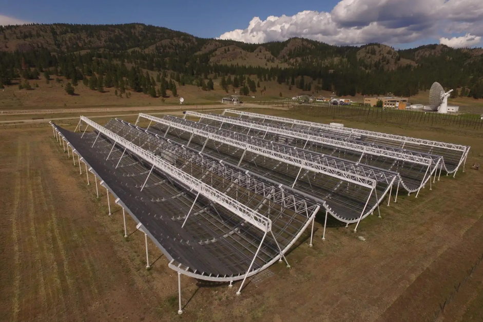

# Current Research 
{align="left": style="height:300px;width:450px"}

Fast radio bursts are mysterious astronomical events. These short (millisecond) bursts of radio waves are believed to have been emitted by unknown sources in distant galaxies. To add to the intrigue, some of these bursts appear to repeat while others do not. It is currently not known whether repeaters and non-repeaters come from the same type of source. My PhD research involves using the [CHIME radio telescope](https://chime-experiment.ca/en) and machine learning methods to examine the morphology of these two categories of radio bursts. As non-repeating events are typically brighter than repeating events, non-repeaters may merely be the brightest burst that we were able to observe from a distant repeating source. Hence, most of the events from that source are too faint to be observed so we incorrectly conclude that they do not repeat.

[CHIME Experiment](https://chime-experiment.ca/en)

## MSc Thesis
## Recent Paper
## BSc Thesis