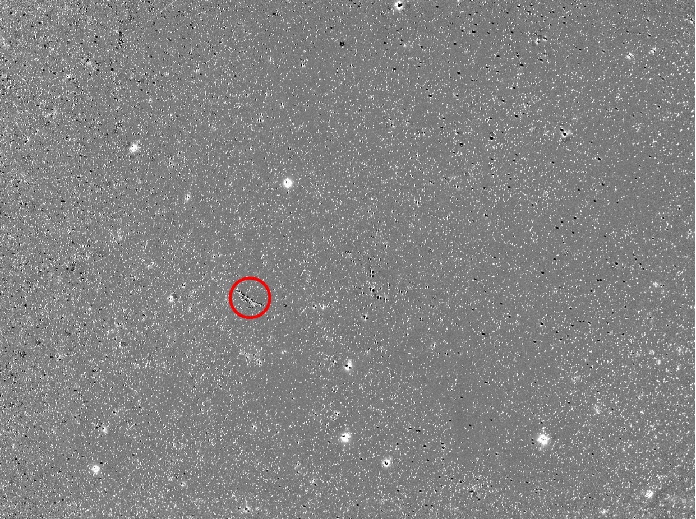
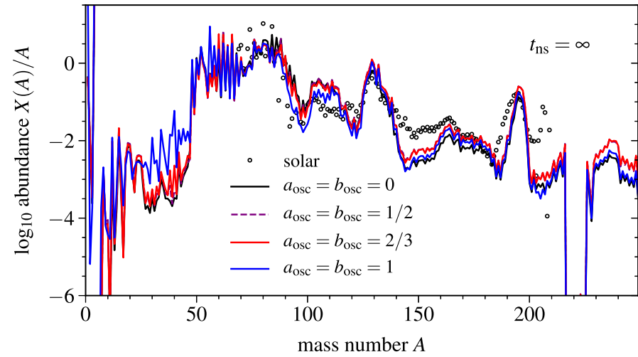

# Current Research 
<figure markdown>
  {style="width:500px"}
  <figcaption> CHIME Radio Telescope, Credit: https://chime-experiment.ca/en </figcaption>
</figure>
Fast radio bursts are mysterious astronomical events. These short (millisecond) bursts of radio waves are believed to have been emitted by unknown sources in distant galaxies. To add to the intrigue, some of these bursts appear to repeat while others do not. It is currently not known whether repeaters and non-repeaters come from the same type of source. My PhD research involves using the [CHIME radio telescope](https://chime-experiment.ca/en) and machine learning methods to examine the morphology of these two categories of radio bursts. As non-repeating events are typically brighter than repeating events, non-repeaters may merely be the brightest burst that we were able to observe from a distant repeating source. Hence, most of the events from that source are too faint to be observed so we incorrectly conclude that they do not repeat.

## MSc Thesis
<figure markdown>
  {style="width:500px"}
  <figcaption> Manufactured Light Echo
</figure>
Light echoes occur when light from a transient source scatters off the surrounding dust. As the light must travel first to the dust and then to the observer, the scattered light takes a longer path and reaches the observer after the direct light. Therefore, light echoes are potentially observable centuries after the direct light. One common source of light echoes is a supernova, a fantastically energetic event that occurs in the final stage of a star's life, hence light echoes are useful for studying historic supernovae. Advances in machine learning for visual recognition have made it possible to detect older and fainter historic supernova light echoes. During my MSc, I improved the supernova light echo machine-learning Python package ALED (Automated Light Echo Detection), created by Bhullar et al. (2021), by adding false positive masks as an additional input.  ALED is visual recognition software that identifies and locates light echoes in images. Additionally, I developed a method for manufacturing and augmenting light echo training sets, and created a process to mask bright star in the images. These stars are typically mislabeled as light echoes, and hence masking them makes light echo identification simpler. My complete MSc thesis can be found [here](https://macsphere.mcmaster.ca/handle/11375/30091).

## Recent Paper
<figure markdown>
  {style="width:550px"}
  <figcaption> Abundances of elements for different neutrino flavour transformation models
</figure>
I utilized the experience I gained during my undergraduate thesis and other undergraduate research to assist with examining how neutrino flavour transformations affect the abundance patterns of r-process elements in hypermassive neutron star outflows. The results are in Section III C of the paper. I post-processed the results of their hydrodynamic simulation with SkyNet, a particle-based nuclear reaction network code, to simulate nucleosynthesis in the hypermassive neutron stars outflow. The paper can be found [here](https://journals-aps-org.proxy3.library.mcgill.ca/prd/abstract/10.1103/PhysRevD.106.103003).

## BSc Thesis
 For my undergraduate thesis with Dr. Rodrigo Fernandez, I worked with SkyNet to simulate nucleosynthesis in binary neutron star mergers and examine the initial conditions required to produce r-process elements. My BSc thesis can be found [here](./Undergraduate_Thesis.pdf).