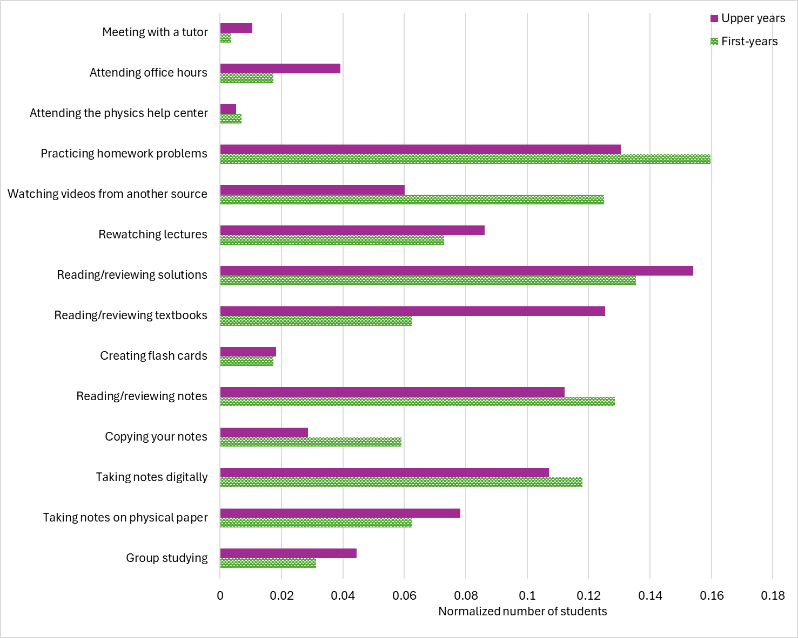

# Teaching

## Scholarship in Teaching and Learning
 I completed a Teaching and Learning Certificate through the MacPherson Institute in the 2023-2024 academic year, which included courses on pedagogy and a research paper titled "Exploring Physics' Negative Reputation and the Implications on Physics Education". 
 
 Simultaneously, I was involved with the Student Partners Program, getting further experience with the scholarship of teaching and learning. Along with my supervisors Dr. Pat Clancy and Dr. Miranda Schmidt, we developed a longitudinal survey to examine students' attitudes toward their programs and courses in the Department of Physics and Astronomy at McMaster University. The long-term goal of this project was to evaluate the effectiveness of undergraduate physics programs.

<figure markdown>
  {style="width:500px"}
  <figcaption> How often do you use these study methods? </figcaption>
</figure>

## Teaching Assistant Experience

At McGill University:

- PHYS 101 Introductory Physics – Mechanics (Fall 2024)

At McMaster University:

- ASTRON 1F03 Introduction to Astronomy and Astrophysics (Fall 2022, Winter 2023, Fall 2023)
- ASTRON 2B03 The Big Questions (in Astronomy) (Fall 2022, Winter 2024)
- PHYSICS 1E03 Waves, Electricity and Magnetic Fields (Winter 2023)
- iSci 1A24 Integrated Science I (Physics) (Fall 2023, Winter 2024)

Additionally, I was a consultant for the third-year integrated science astronomy class and assisted small groups of students with their research projects.