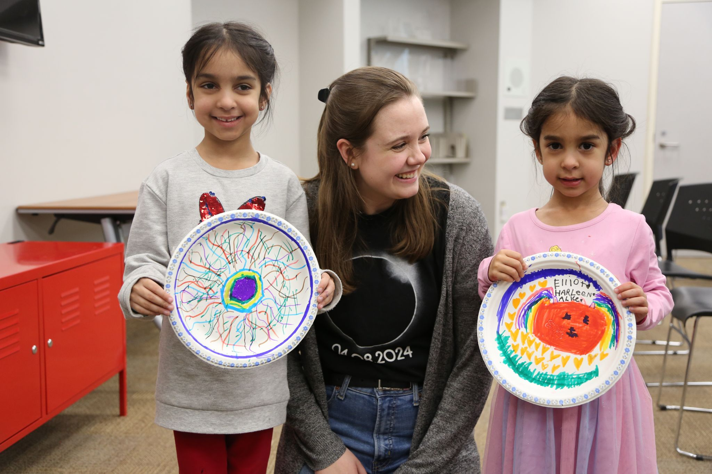

# Volunteering
Please see my [CV](./CV_Nicole_Mulyk.pdf) for a complete list of my volunteer activities.

An important step to making the physics and astronomy communities more diverse is making our research more approachable to the public. Outreach events motivate future scientists to pursue careers in academia.

<figure markdown>
  {style="width:600px"}
  <figcaption> Credit: Jay Robb/McMaster University
</figure>

## Public Outreach Highlights
- Volunteer Coordinator for [Astronomy on Tap Montreal](https://astronomyontap.org/locations/montreal-qc-canada/)
- Volunteer with [Canadian Astronomical Society's Westar Program](https://casca.ca/?page_id=7598): building long-term, reciprocal relationship with under-served communities in northern Canada and sharing a mutual exchange of astronomy knowledge
- Eclipse Ambassador: Giving public talks about the 2024 Total Solar Eclipse ([article](https://gs.mcmaster.ca/eclipse-ambassador-brings-science-into-the-community/))
- Presenter at the [W.J. McCallion Planetarium](https://planetarium.physics.mcmaster.ca/)

## Promoting Equity, Diversity, and Inclusion in the Physics Community

I am passionate about promoting equity, diversity, and inclusion (EDI) in physics and astronomy. As a woman in astrophysics, I have often felt alienated and demotivated to continue in academia. However, this has inspired me to revitalize the astrophysics community and make it more inclusive for equity-deserving communities. Throughout my academic career, I have sought roles that allow me to advocate for my classmates.

- I was elected as the graduate student representative in the Department of Physics and Astronomy EDI Committee at McMaster University in 2023-2024.
- As an undergraduate student, I helped organize the [Canadian Conference for Undergraduate Women in Physics 2022](https://ccuwip.cap.ca/about/past-locations/2022-virtual/), a virtual conference intended for undergraduate students who belong to equity-seeking groups and are interested in physics.